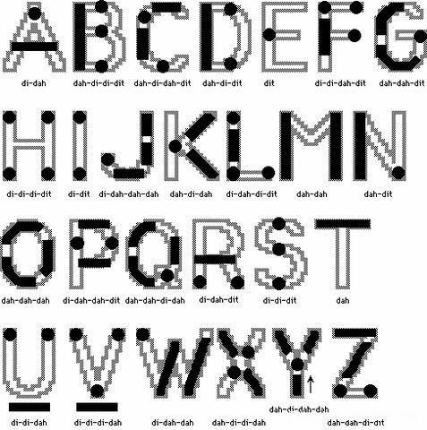
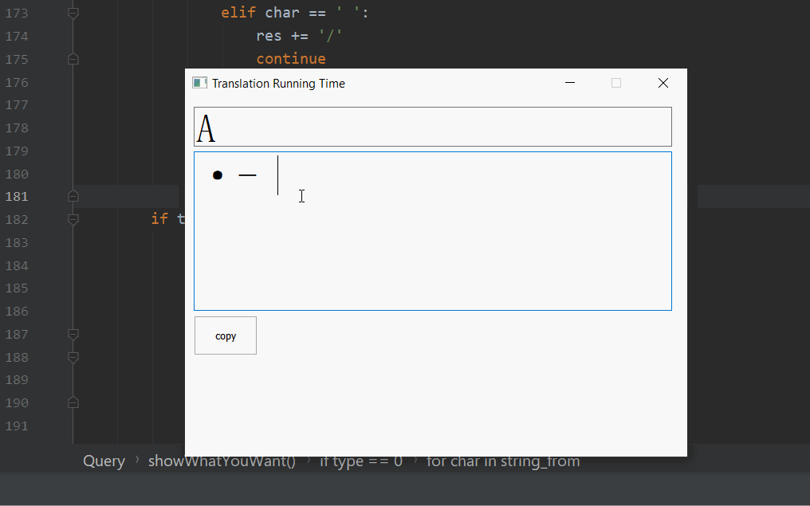

# Morse-Code-Method
morse code &lt;-> english letter

## Intro

| alpha | morse  | alpha | morse  |
| :---: | :----  | :---: | :----  | 
|  `A`  | `.-`   |  `N`  | `-.`   |
|  `B`  | `-...` |  `O`  | `---`  |
|  `C`  | `-.-.` |  `P`  | `.--.` |
|  `D`  | `-..`  |  `Q`  | `--.-` |
|  `E`  | `.`    |  `R`  | `.-.`  |
|  `F`  | `..-.` |  `S`  | `...`  |
|  `G`  | `--.`  |  `T`  | `-`    |
|  `H`  | `....` |  `U`  | `..-`  |
|  `I`  | `..`   |  `V`  | `...-` |
|  `J`  | `.---` |  `W`  | `.--`  |
|  `K`  | `-.-`  |  `X`  | `-..-` |
|  `L`  | `.-..` |  `Y`  | `-.--` |
|  `M`  | `--`   |  `Z`  | `--..` |

only letter part, i have not done the number * notion part

Plus a pic for memorization

## Usage
#:TODO

